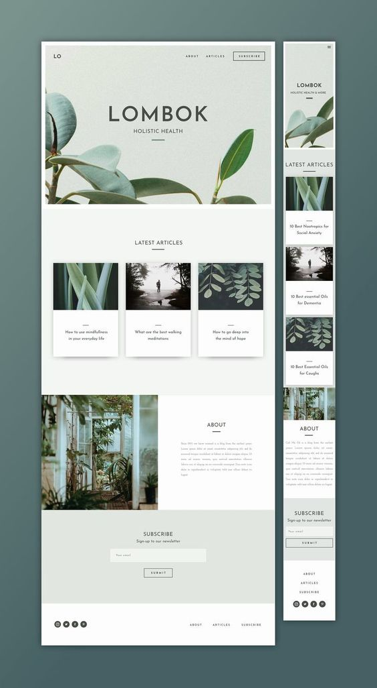
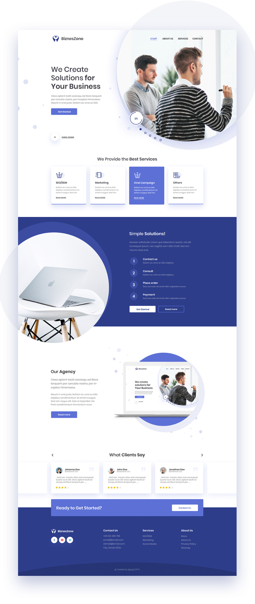

# Design Projects

I've recently got into watching [Hyperplexed](https://www.youtube.com/@Hyperplexed) and decided I wanted to do something like what he does.

I've decided I'm going to pick a website and do two things to it.  I'm going to recreate the website as best as I can.  If I want to challenge myself I will start finding ways to improve it

I'm going to keep a list of the projects listed in here for easy access and describe them hopefully like little blog posts

### [Project 1](https://github.amias.dev/design-projects/project-1)
## [Minimalist Pinterest post](https://pin.it/366MPyK)

I hade found a pinterest post which I decided I would recreate.  It's a fairly simple one but I wanted to test the use of [Sass Mixins](https://sass-lang.com/documentation/at-rules/mixin) and how I can structure the css in a way that cuts down the speed it takes to replicate a design.

This project has gone well in my opinion, I've used some simple jquery to animate the header and nav bar.  This was not on the design but seemed like the right fit for the style of website I was doing.

### [Project 2](https://github.amias.dev/design-projects/project-2)
## [Pinterest Post](https://pin.it/3gYnMsv)

I have found another design on Pinterest, this time with a little more going on to be a little more challenging.

***Currently Being built***

## Bibliography

- [Shutterstock](https://shutterstock.com) was used to create a simple logo for [Project 1](#project-1)
- [Coolors](https://coolors.co) was used to get the colour theme used in projects, either from [Image Picker](https://coolors.co/image-picker) or the [Generator](https://coolors.co/generate) they have.